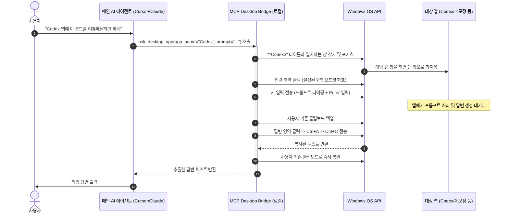

# 🖥️ Windows Desktop GUI Automation MCP Server

Python으로 작성된 프로덕션 수준의 오픈 소스 모델 컨텍스트 프로토콜(MCP) 서버입니다. 이 서버는 Cursor, Claude Desktop, Windsurf 등과 같은 AI 클라이언트가 OS 수준의 GUI 입력을 사용하여 Windows 데스크톱 앱(Codex, ChatGPT, 메모장, Obsidian 등)을 직접 제어하고 자동화할 수 있도록 지원하는 브리지 역할을 합니다.

---

## 🗺️ 동작 원리 (아키텍처)

이 서버는 `pywinauto` 라이브러리를 사용해 Windows API와 통신하며, 대상 애플리케이션 포커싱, 상대 좌표 클릭, 텍스트 타이핑, 단축키 전송 등을 수행합니다. 사용 중인 클립보드의 손실을 방지하기 위한 안전한 백업 및 복원 메커니즘을 내장하고 있습니다.



---

## 🛠️ 제공되는 MCP 도구 (Tools)

등록된 AI 클라이언트가 호출할 수 있는 도구 목록입니다:

### 1. `list_active_windows`
현재 실행 중인 프로세스 중 활성화되어 눈에 보이는 GUI 창 타이틀 목록을 보여줍니다.
*   **용도**: AI나 사용자가 제어하고 싶은 대상 앱의 정확한 창 타이틀명과 프로세스명을 확인하기 위해 사용합니다.
*   **출력 형식**:
    ```json
    [
      { "pid": 15892, "process_name": "Codex.exe", "window_title": "Codex" },
      { "pid": 4820, "process_name": "notepad.exe", "window_title": "test_note.txt - 메모장" }
    ]
    ```

### 2. `ask_desktop_app`
대상 애플리케이션 창에 텍스트 프롬프트를 전송하고, 답변이 나오면 이를 복사하여 텍스트로 반환합니다.
*   **매개변수**:
    *   `app_name` (str): 대상 앱 이름 (`config.yaml`에 정의된 프로필명, 예: `"Codex"`, `"Notepad"`).
    *   `prompt` (str): 앱에 보낼 질문 혹은 입력 텍스트.
    *   `wait_seconds` (int, 선택): 답변 출력을 기다릴 시간(초 단위, 미지정 시 기본 설정값 적용).
*   **사용 예시**: 로컬 AI 데스크톱 앱(Codex, ChatGPT Desktop)에 질문을 던지고 결과 요약받기.

### 3. `send_keys_to_app`
대상 애플리케이션 창에 마우스 클릭 없이 원격 키 입력 및 단축키를 전송합니다.
*   **매개변수**:
    *   `app_name` (str): 대상 앱 이름.
    *   `keys` (str): 전송할 키 조합. `pywinauto` 입력 형식을 따릅니다. (예: 새 노트 만들기 `^n`, 저장하기 `^s`, 엔터 `{ENTER}`, 탭 `{TAB}`).
*   **사용 예시**: 메모장이나 Obsidian 등에서 파일을 자동으로 저장하거나 메뉴를 탐색할 때 사용.

---

## ⚙️ 설정 파일 (`config.yaml`)

대상 앱마다 입력창의 위치나 대기 시간이 다르므로, 설정 파일에서 앱별 프로필을 구성하여 쉽게 튜닝할 수 있습니다.

```yaml
apps:
  Codex:
    window_title_re: "^Codex$"
    input_offset_y: -80        # 창 아래에서 위로 80픽셀 지점 (텍스트 입력창) 클릭
    chat_offset_y: -500        # 복사를 위해 창 중앙 근처 클릭하여 포커스
    default_wait: 12           # AI 답변을 대기할 기본 시간 (초)

  Notepad:
    window_title_re: ".*Notepad.*|.*메모장.*"
    input_offset_y: 150        # 창 위에서 아래로 150픽셀 지점 클릭
    chat_offset_y: 150
    default_wait: 1

default:
  input_offset_y: -80
  chat_offset_y: -300
  default_wait: 10
  keystroke_delay: 0.01        # 한 글자씩 타이핑하는 딜레이 간격 (초)
```

---

## 🔍 대상 앱 이름 및 타이틀 찾는 방법 (가이드)

`config.yaml`에 등록하기 위해 대상 앱의 정확한 윈도우 타이틀이나 프로세스명을 알아내는 방법입니다.

### 방법 A: AI 에이전트에게 바로 요청하기
Cursor나 Claude 등 연동된 AI 창에 다음과 같이 자연어로 물어보면 AI가 직접 도구를 실행해 찾아 줍니다:
> *"지금 화면에 켜져 있는 창 목록을 보여줘."*

AI가 `list_active_windows` 도구를 구동하여 현재 열려 있는 창 타이틀과 프로세스명을 정돈해 보여줍니다.

### 방법 B: PowerShell 활용하기
윈도우 PowerShell 창을 열고 아래 명령어를 입력합니다:
```powershell
Get-Process | Where-Object {$_.MainWindowTitle} | Select-Object ProcessName, MainWindowTitle, Id
```

---

## 🚀 설치 및 설치 가이드

### 요구사항
*   Windows OS (Windows 10/11)
*   Python 3.10 이상

### 1. 레포지토리 복제 및 패키지 설치
```bash
git clone <repository-url>
cd desktop-mcp-bridge
pip install -e .
```
이 명령어는 `mcp`, `pywinauto`, `pywin32`, `pyyaml`, `psutil` 등 필요한 모든 라이브러리를 자동으로 설치합니다.

### 2. AI 클라이언트에 연결하기

#### Cursor IDE 설정 방법
1. Cursor의 우측 상단 **Settings(톱니바퀴) > Models > MCP** 메뉴로 이동합니다.
2. **+ Add New MCP Server** 버튼을 클릭합니다.
3. 설정을 다음과 같이 입력합니다:
   *   **Name**: `desktop-bridge`
   *   **Type**: `command`
   *   **Command**: `mcp-desktop-bridge` (또는 절대 경로를 포함한 `python -m mcp_desktop_bridge.server`)

#### Claude Desktop 설정 방법
아래 설정을 Claude 설정 파일(`%APPDATA%\Claude\claude_desktop_config.json`)에 추가합니다:
```json
{
  "mcpServers": {
    "desktop-bridge": {
      "command": "python",
      "args": [
        "-m",
        "mcp_desktop_bridge.server"
      ],
      "env": {
        "PYTHONPATH": "C:/경로/to/desktop-mcp-bridge/src"
      }
    }
  }
}
```

---

## 🔒 클립보드 안전성 및 보안 정책
*   **클립보드 무중단 복원**: 본 서버는 답변을 텍스트로 읽어오기 위해 임시 복사(`Ctrl+C`) 명령을 수행하지만, **복사 직전에 사용자가 기존에 복사해 두었던 클립보드 데이터를 메모리에 백업하고, 텍스트 조작 직후 즉시 원상 복원**합니다. 일상적인 작업 중 클립보드 내역이 강제로 소실되지 않으므로 안심하고 사용하실 수 있습니다.
*   **포커스 이동 유의**: GUI 자동화 특성상 질문을 입력하고 복사하는 순간에는 해당 앱이 최전면(Foreground)으로 일시적으로 활성화됩니다.
